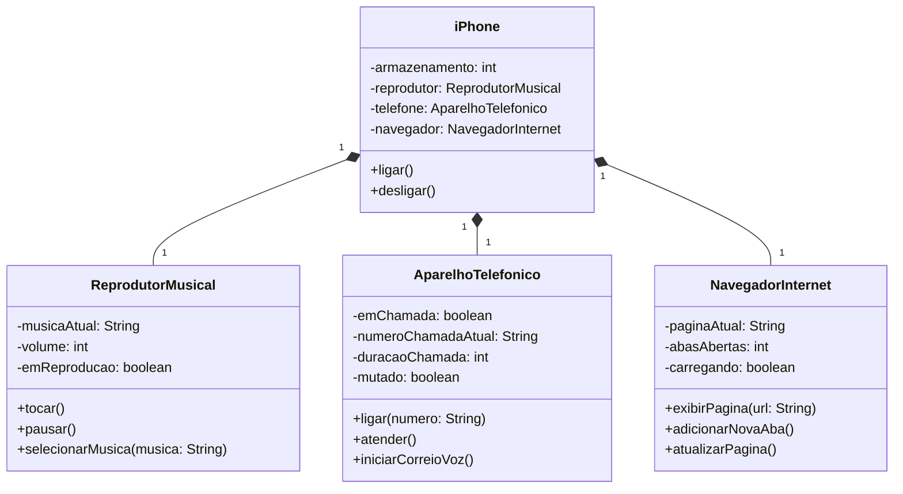

```mermaid
classDiagram
    class iPhone {
        -armazenamento: int
        -reprodutor: ReprodutorMusical
        -telefone: AparelhoTelefonico
        -navegador: NavegadorInternet
        +ligar()
        +desligar()
    }

    class ReprodutorMusical {
        -musicaAtual: String
        -volume: int
        -emReproducao: boolean
        +tocar()
        +pausar()
        +selecionarMusica(musica: String)
    }

    class AparelhoTelefonico {
        -emChamada: boolean
        -numeroChamadaAtual: String
        -duracaoChamada: int
        -mutado: boolean
        +ligar(numero: String)
        +atender()
        +iniciarCorreioVoz()
    }

    class NavegadorInternet {
        -paginaAtual: String
        -abasAbertas: int
        -carregando: boolean
        +exibirPagina(url: String)
        +adicionarNovaAba()
        +atualizarPagina()
    }

    iPhone "1" *-- "1" ReprodutorMusical
    iPhone "1" *-- "1" AparelhoTelefonico
    iPhone "1" *-- "1" NavegadorInternet
```