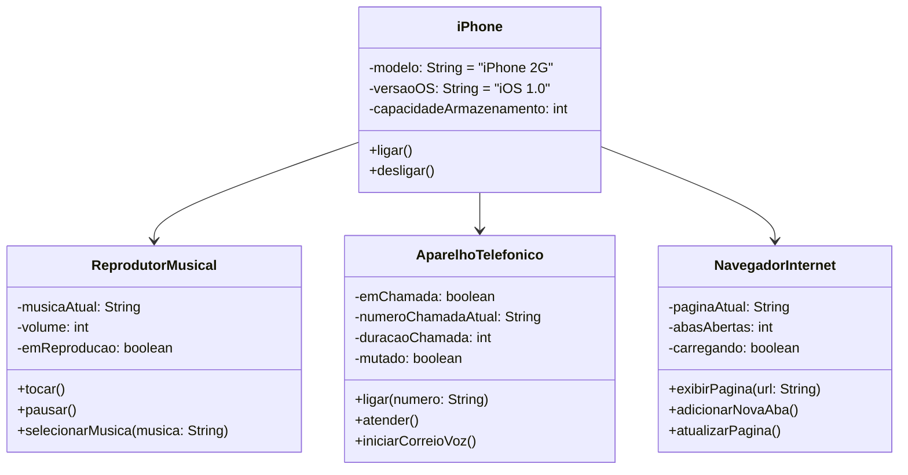

```mermaid
classDiagram
    class iPhone {
        -modelo: String = "iPhone 2G"
        -versaoOS: String = "iOS 1.0"
        -capacidadeArmazenamento: int
        +ligar()
        +desligar()
    }

    class ReprodutorMusical {
        -musicaAtual: String
        -volume: int
        -emReproducao: boolean
        +tocar()
        +pausar()
        +selecionarMusica(musica: String)
    }

    class AparelhoTelefonico {
        -emChamada: boolean
        -numeroChamadaAtual: String
        -duracaoChamada: int
        -mutado: boolean
        +ligar(numero: String)
        +atender()
        +iniciarCorreioVoz()
    }

    class NavegadorInternet {
        -paginaAtual: String
        -abasAbertas: int
        -carregando: boolean
        +exibirPagina(url: String)
        +adicionarNovaAba()
        +atualizarPagina()
    }

    iPhone --> ReprodutorMusical
    iPhone --> AparelhoTelefonico
    iPhone --> NavegadorInternet
```